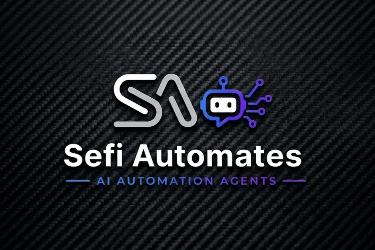

<p align="center"></p>

<h1 align="center">sefi-agents</h1>
<p align="center"><strong>A software company in a plugin.</strong></p>

<p align="center">
<a href="https://github.com/xsefirosus/sefi-agents/actions/workflows/ci.yml"></a>
<a href="LICENSE"></a>
<a href="#faq"></a>
<a href="#works-with-your-harness"></a>
</p>

Thirteen markdown-defined agents -- product manager, full-stack engineer, QA, security,
DevOps, design, and more -- that plan, build, judge, and remember as a team, with hard
budget caps and a human holding the merge button. Plain markdown plus POSIX shell.
Nothing to install, nothing phoning home.

```
/plugin marketplace add xsefirosus/sefi-agents
/plugin install sefi-core@sefi-agents
/sefi:init
```

Or hand the setup to any coding agent:

> Help me set up sefi-agents by following
> https://raw.githubusercontent.com/xsefirosus/sefi-agents/main/Install.md

**Contents:** [Why this exists](#why-this-exists) -- [The receipts](#the-receipts-real-numbers-first-party)
-- [How it compares](#how-it-compares) -- [The team](#the-team-13-agents) --
[The skills](#the-skills-12) -- [The loops](#the-loops-2-shipped-template-for-more) --
[Memory](#memory-that-survives-the-session) -- [Harness support](#works-with-your-harness) --
[Safety rails](#safety-rails-all-of-them-in-one-place) -- [Proof](#proof) -- [FAQ](#faq) --
[Contributing](#contributing) -- [License](#license)

## Why this exists

Most agent setups fail the same three ways: **the writer grades its own homework** and
calls broken work done; **tokens blow out** because nothing bounds a runaway loop; and
**every session starts amnesiac** because state lives in a context window that evaporates.

We know because we shipped all three failures first. sefi-agents is the rebuild of the
author's previous agent system (a Python/FastAPI build), after an independent
audit of it -- and instead of hiding the post-mortem, this repo ships it as
[docs/ANTIPATTERNS.md](docs/ANTIPATTERNS.md), with every failure mapped to the mechanism
here that prevents it.

## The receipts (real numbers, first-party)

Every figure below comes from the predecessor's audit, documented in
[docs/ANTIPATTERNS.md](docs/ANTIPATTERNS.md) and [docs/BUDGET.md](docs/BUDGET.md). No
number in this README is invented -- that discipline is itself a shipped skill
(anti-hallucination).

| What happened (live, in the predecessor) | What ships here because of it |
|---|---|
| 184 green tests while half the new modules had zero call sites | the qa-engineer's wired-not-just-written check + an unwired-artifact linter in CI |
| one self-batching dispatch burned 1.36M tokens | a hard per-dispatch cap ($0.15 default) that trips long before the daily cap |
| ~324K tokens lost re-asking for JSON that was present but not at position 0 | a 3-rung parse ladder that accepts structured output anywhere in a reply |
| a broken browser tool silently ate a 50-iteration retry budget | tools are probed before a loop may grant them |
| free-model dispatch succeeded ~45% of the time -- and still delivered | gates and human checkpoints are load-bearing, so a cheap model is enough |

## How it compares

An honest comparison, no names -- check any framework you are evaluating against these
rows yourself:

| | sefi-agents | typical agent framework |
|---|---|---|
| Who judges the work | a separate adversarial qa-engineer, different instructions, different model where possible | the model that wrote it reviews itself |
| Verdict basis | executed evidence: re-run commands, before/after pairs | "the code looks right" |
| Runtime | markdown + POSIX shell (git, rg, coreutils) | a language runtime + dependency tree |
| Cost control | hard caps: per-run, daily, AND per-dispatch | rarely built in |
| Memory | a human-readable Obsidian-style vault, in your git repo | opaque state or a hosted service |
| Autonomy boundary | opens PRs, never merges -- one canonical never-auto-merge rule | often merge- or deploy-capable by default |
| Hallucination policy | UNKNOWN/PENDING instead of plausible guesses, CI-enforced in every agent and skill | unstated |
| Self-improvement | bounded (3 sentences/file/run), single-writer, opt-out | unbounded or absent |
| Portability | Claude Code, Hermes, OpenCode, Codex | usually locked to its own runner |

The edges, spelled out: the work is judged by an adversary, not its author; the whole
thing runs where a shell runs, with nothing to pip-install; a runaway dispatch hits a cap
in cents, not dollars; your team's memory is markdown you can open, diff, and grep; and
nothing irreversible happens without a human. If a framework you are considering can say
all five, use whichever you like.

## The team (13 agents)

An org chart, not a swarm. Each agent is a markdown file with a tool whitelist, a named
model tier, an output contract, and an escalation path.

| Agent | Use for | Tier |
|---|---|---|
| engineering-manager | routes work, enforces contracts and budgets, never codes | sonnet |
| research-analyst | web/repo/doc context, returned as a bounded digest | haiku |
| product-manager | goal -> checkable plan with grep-countable steps | sonnet |
| ui-ux-designer | build, audit, redesign, or study a UI, direction-first | sonnet |
| software-engineer | full-stack vertical slices in isolated worktrees | sonnet |
| qa-engineer | adversarial PASS/REJECT against executed evidence | opus |
| security-engineer | trust-boundary review: secrets, injection, deps | opus |
| devops-engineer | CI/CD, worktrees, scheduling, budget plumbing | sonnet |
| support-engineer | inbox and issue triage, consume-before-act | haiku |
| knowledge-manager | memory vault curation, append-only | haiku |
| technical-writer | READMEs, changelogs, guides -- verified claims only | haiku |
| solutions-architect | n8n / Make / GoHighLevel / RAG / Vapi specs | sonnet |
| quant-analyst | trading-strategy gates and tier promotion | sonnet |

Model tiers are advisory: on runtimes that set the model globally they are ignored, and
the whole roster is designed to hold up on a small free model (see the ~45% row above --
the gates carry the quality, not the model).

## The skills (12)

The always-loaded router stays thin; craft lives in skills that load on demand:

- **sefi-orchestration** -- routing, handoffs with pinned output paths, the parse ladder.
- **anti-hallucination** -- the canonical no-invention rule: UNKNOWN and PENDING instead
  of plausible guesses; every claim traces to a file, a command, or a named source.
  CI rejects any agent or skill missing its pointer to this rule.
- **frontend-design** -- anti-slop UI across build/audit/redesign/study: one committed
  direction from a named lane catalog, typography-first, WCAG AA as a gate, plus
  illustrative domain heuristics and a two-tier slop-tells checklist.
- **backend-design** -- contract-first APIs, trust-boundary validation, idempotent
  mutations, reversible migrations, an explicit error taxonomy.
- **security-review** -- the six-surface gate: secrets, injection, unsafe constructs,
  dependencies, authorization, data handling.
- **memory-protocol** -- the vault contract: router reads, privacy-filtered writes,
  tiered promotion (trace -> policy -> fact).
- **loop-engineering** -- the five moves every loop implements: discovery, handoff,
  verification, persistence, scheduling.
- **retro-improve** -- bounded self-improvement: edits only its own files, 3 sentences
  per file per run, new skills require human approval.
- **technical-writing** -- audience-first docs where every command was actually run.
- **strategy-gate** -- hard trading gates (PF >= 1.30, DD <= 5%, expectancy >= 0.20R,
  CoV <= 0.25) with a promotion ladder.
- **n8n-workflow-design** -- client automation specs with idempotency, retries, webhook
  security, and cost-per-run.
- **terse-mode** -- output compression for narration, config-gated (ships enabled).

## The loops (2 shipped, template for more)

Every loop is the same five-move cycle -- a loop spec that skips one doesn't ship; CI
rejects it:


- **morning-triage** -- daily: support-engineer discovers (failed CI, new issues),
  software-engineer drafts in isolated worktrees, qa-engineer judges, PRs open for you.
- **weekly-retro** -- weekly: reads the metrics ledger, proposes bounded skill
  improvements, logs SKIP with a reason when the data says nothing needs changing.

Every loop names all five moves plus its human checkpoint, and CI rejects one that does
not. `/sefi:loop-new` scaffolds your own.

## Memory that survives the session

`/sefi:init` scaffolds an Obsidian-compatible vault in your project: daily notes,
decisions with supersede-never-delete semantics, and a generated router injected (capped
at 1,500 chars) at session start. It is markdown in your repo -- open it in Obsidian,
grep it, diff it in PRs. No database, no service, no vendor.

## Works with your harness

| Harness | How | Notes |
|---|---|---|
| Claude Code | plugin install (above) | full hook + subagent support |
| Hermes Agent | [adapters/HERMES.md](adapters/HERMES.md) | one-command skill install (`install-hermes.sh`); 10 of 12 install automatically, 2 print a verified manual fix inline -- see FAQ |
| OpenCode | [adapters/OPENCODE.md](adapters/OPENCODE.md) | headless `opencode run` for CI loops |
| Codex | [adapters/CODEX.md](adapters/CODEX.md) | plugin marketplace install; `multi_agent` enabled by default |

## Safety rails (all of them, in one place)

- The writer never grades its own work; a separate qa-engineer judges executed evidence.
- A security-engineer gates diffs that touch trust boundaries.
- Deterministic gates (lint, tests) run in scripts the model cannot skip.
- Hard budget caps: per-run, daily, per-dispatch; retries capped and counted on disk.
- Anything uncertain lands in `inbox/` for you, with a fixed confirm/change/exit contract.
- Loops open PRs; merging is yours. One canonical rule, linked from every agent that
  could reach a destructive action.

## Proof

The repo lints itself. This suite runs on every push (badge above), and locally in one
command:

```
$ bash plugins/sefi-core/scripts/ci/run-all.sh
validate-agents: OK (13 agent files validated)
validate-skills: OK (12 SKILL.md validated)
validate-loops: OK (2 loop spec(s) validated)
validate-budget: OK (all caps present and bounded)
validate-no-personal-paths: OK (no personal paths in shipped files)
validate-no-orphans: OK (references, templates, agents all wired)
check-unicode-safety: OK (89 files scanned, ASCII-clean)
validate-token-budget: OK (all within token budgets; agents total 6961 words)
CI: all validators passed
```

That last validator is real: agents have word budgets, skills have line caps, and prose
that bloats fails the build.

## FAQ

**Do I need expensive models?** No. Model tiers are advisory, and the architecture
assumes a cheap model: deterministic scripts assemble context and enforce gates, the LLM
only does the creative step between them. The predecessor ran at ~45% dispatch success on
a free model and still delivered, because the gates caught the other half.

**Does it work on Windows?** Yes -- the scripts are POSIX-friendly and this repo is built
and CI-validated via Git Bash on Windows as well as Linux CI.

**Where does my data go?** Nowhere. There is no runtime, no telemetry, and no network
call in the plugin. If you use a free-window model via an adapter, read the caveat in
[adapters/HERMES.md](adapters/HERMES.md) first: never run client or proprietary code
through models that may train on inputs.

**Can it merge or deploy something by itself?** No. Loops open PRs and stop. The rule is
stated once, linked everywhere, and CI checks every loop names its human checkpoint.

**What happens when the model does not know something?** It says so: unknown lookups
come back as UNKNOWN and uncomputed values as PENDING -- never a plausible guess. That
rule is a skill, and CI fails any agent or skill that drops its pointer to it.

**Why didn't all the skills install automatically on Hermes?** Hermes runs its own
community-skill security scanner, and two skills -- `sefi-orchestration` and
`security-review` -- trip it as false positives: their content *names* dangerous
patterns (subagent dispatch, eval/exec, unpinned downloads) specifically to guard
against them, and the scanner can't yet tell "warns about" from "does."
`install-hermes.sh` still installs the other 10 automatically, and the moment it
detects either of the two missing, it prints the exact fix inline: a direct copy that
bypasses the scanner entirely, verified to work and shown as `Source=local, enabled` in
`hermes skills list` afterward. See [adapters/HERMES.md](adapters/HERMES.md) section 8.

**Do I need Obsidian?** No. The vault is plain markdown; Obsidian just makes it nicer.

**A skill or user-invoked command calling another?** A user-invoked skill may invoke
model-invoked skills, never another user-invoked one.

## Contributing

Run the suite before a PR:

```
bash plugins/sefi-core/scripts/ci/run-all.sh
```

The validators are the contribution guide in executable form: budgets, single-line
descriptions, wired references, ASCII-clean text, and the anti-hallucination pointer in
every agent and skill.

## License

MIT. See [LICENSE](LICENSE).
