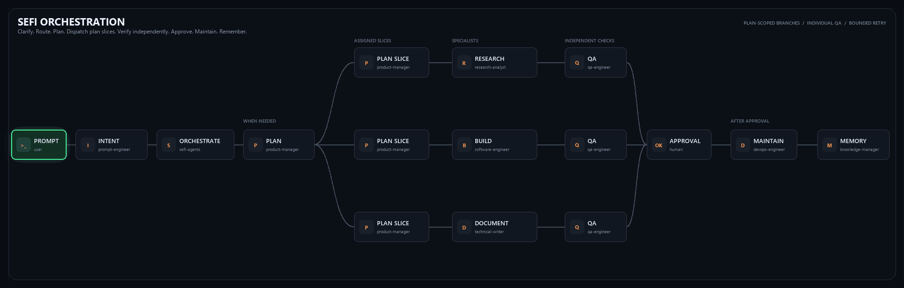
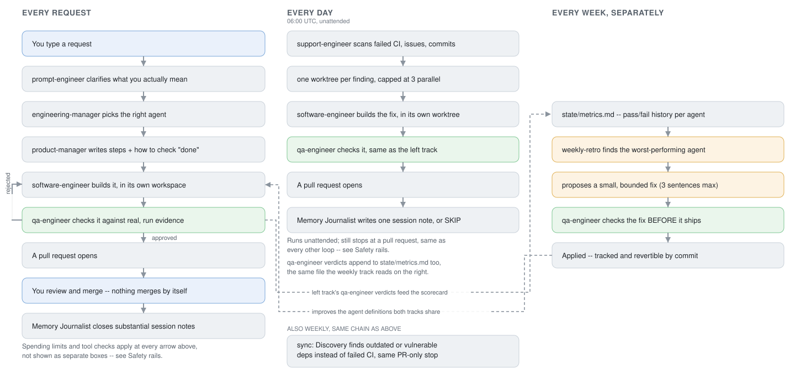

<p align="center"></p>

<h1 align="center">sefi-agents</h1>
<p align="center"><strong>A software company in a plugin.</strong></p>

<p align="center">
<a href="https://github.com/xsefirosus/sefi-agents/actions/workflows/ci.yml"></a>
<a href="LICENSE"></a>
<a href="#faq"></a>
<a href="#works-with-your-harness"></a>
</p>

17 AI agents -- a planner, a builder, a reviewer, a security checker, a writer,
and more -- that work as a team: plan, build, check, and remember, with spending limits
and a human approving every merge.

No database, server, or separate runtime: just this plugin and the AI tool you already
use.

<p align="center">
  
</p>

**Install for Claude Code:**

```
/plugin marketplace add xsefirosus/sefi-agents
/plugin install sefi-core@sefi-agents
/sefi:init
```

Using OpenCode, Hermes Agent, or Codex instead? The install steps are different for each
-- see [Where it runs](#works-with-your-harness) below, don't run the commands above.

**Install for Codex:**

```sh
git clone https://github.com/xsefirosus/sefi-agents.git
cd sefi-agents
bash install-codex.sh
```

Then open a new Codex session and accept the one-time hook trust prompt when Codex shows
it. From then on, ordinary prompts in every project load Sefi routing automatically; you
do not need a `/sefi:*` command for each request. Sefi subagents use the configured Codex
model policy: Astra for orchestration, Sol for QA/security, Terra for build/planning, and
Luna for research and writing.

**Other harnesses:** use `bash install.sh --target <claude|opencode|hermes|codex>`. The
installer reads a verified adapter manifest. A new or private harness can use a complete
local manifest with `--adapter path/to/adapter.yml`; it is usable locally, not represented
as a supported harness until its adapter tests are added and pass.

Or hand the setup to any coding agent -- this one detects which tool you're using and
installs the right way for it, Claude Code or otherwise:

> Help me set up sefi-agents by following
> https://raw.githubusercontent.com/xsefirosus/sefi-agents/main/Install.md

**Contents:** [Why this exists](#why-this-exists) -- [How it compares](#how-it-compares) --
[The team](#the-team-16-agents) -- [The skills](#the-skills-19) --
[The commands](#the-commands-12) --
[How a request gets done](#how-a-request-actually-gets-done) --
[Memory](#memory-that-survives-the-session) -- [Where it runs](#works-with-your-harness) --
[Safety rules](#safety-rails-all-of-them-in-one-place) -- [Proof](#proof) -- [FAQ](#faq) --
[Contributing](#contributing) -- [Credits](#credits) -- [License](#license)

## Why this exists

Most AI coding setups fail the same three ways:

- **The AI grades its own homework.** The same model that writes the code also reviews
  it, so it rarely catches its own mistakes.
- **Spending gets out of control.** Nothing stops a task from running (and costing money)
  far longer than it should.
- **Every conversation starts from zero.** Whatever the AI learned yesterday is gone
  today, because nothing wrote it down.

We hit all three problems first, in the author's earlier version of this project. That
post-mortem is public, not hidden: [docs/ANTIPATTERNS.md](docs/ANTIPATTERNS.md) lists each
failure next to the fix that now prevents it.

**Where these ideas come from.** The generator/verifier split matches current
graph-engineering practice's "diamond pattern" -- split, parallel workers, a separate
verifier node, merge, never a worker verifying its own branch. The qa-engineer's blind,
named-bar review is the same idea Matt Shumer's "Gauntlet Loop" popularized, with one
deliberate difference: this repo caps it (PASS/REJECT under a fixed retry limit), rather
than looping until a critic is satisfied. And the whole shape -- a WIP limit on parallel
work, a pull-based `state/`/`inbox/` board, CI that stops at a pull request instead of
deploying -- is Kanban and CI/CD, with the CD half cut off on purpose.

## How it compares

Three real incidents from this project's own history, no made-up "after" numbers -- full
history in [CHANGELOG.md](CHANGELOG.md):


(Usage is measured in "tokens" -- small chunks of text AI providers use to price and
limit how much a task can do.)

## The team (17 agents)

17 AI agents, each with one job and a written contract for what it may touch, run,
and change -- grouped by how strong a model each one gets:

**Reviewers (strongest model):** `qa-engineer` approves or rejects finished work with
evidence -- `security-engineer` checks anything touching logins, secrets, or outside
input.

**Builders (mid-strength model):** `sefi-agents` routes work and never codes --
`product-manager` turns a goal into a checkable plan -- `software-engineer` builds one
piece at a time, in its own workspace -- `ui-ux-designer` handles interface work --
`motion-designer` plans and audits nontrivial interaction motion without changing visual
direction --
`devops-engineer` runs CI/CD and scheduling -- `solutions-architect` designs automations
(n8n, Make, GoHighLevel) -- `systems-auditor` reviews department outputs against their
gates and never builds.

**Support crew (cheapest model):** `research-analyst` gathers context -- `support-engineer`
sorts incoming issues -- `memory-journalist` writes private session notes -- `technical-writer`
writes docs, claims double-checked -- `prompt-engineer` clarifies a raw request first.

**Repository research:** `codebase-cartographer` maps local code with source evidence --
`adoption-scout` reviews external repositories before the Product Manager considers a plan
addition.

## The skills (19)

Playbooks an agent loads only when the task needs it, not another agent -- most load
automatically, a few you call by name, and a named skill can never chain another one, so
it can't silently escalate on its own:

**Always relevant:** `sefi-orchestration` (routes every request) -- `anti-hallucination`
(the core honesty rule: say "unknown" instead of guessing, CI-enforced everywhere).

**Building & reviewing:** `frontend-design`, `backend-design`, `security-review` --
interface, API, and security best practices.

**Design Council:** `motion-design`, `swiftui-design`, `expo-native-design`, and
`design-style-profiles` -- motion planning, platform-specific UI guidance, and controlled
style tuning. SwiftUI and Expo guidance load only for their platform.

**Memory & process:** `memory-protocol`, `loop-engineering`, `retro-improve` -- how
memory is read and written, the five-step loop pattern, and small self-improvements.

**Specialized:** `technical-writing`, `n8n-workflow-design`, `terse-mode`, `premortem`
(forensic pre-execution failure analysis, invoked by name), `focus`, `release-tracking`
(reconciles one version across six publish surfaces before calling anything released),
`run-sefi-benchmark` (blinded paired A/B benchmark of the chain versus one strong model,
invoked by name).

## The commands (13)

**Project setup and memory:** `/sefi:init` -- `/sefi:close-session` --
`/sefi:cross-memory` -- `/sefi:memory-search` -- `/sefi:memory-index`.

**Repository work:** `/sefi:map-codebase` -- `/sefi:scout` -- `/sefi:triage` --
`/sefi:route`.

**Process:** `/sefi:retro` -- `/sefi:status` -- `/sefi:loop-new` -- `/sefi:audit`.

The mapping command supports MAP, TRACE, IMPACT, DELTA, VISUALIZE, and CONTEXT. It creates
evidence-backed local maps and bounded handoff packets; it never changes the mapped source.
Read [Repository Intelligence](docs/REPOSITORY-INTELLIGENCE.md) for freshness, privacy,
optional connector, and documentation-grounding rules.

## Design Council

UI/UX Designer owns a product's visual direction. Motion Designer owns only nontrivial
temporal behavior. Design tasks record Product Context, a chosen direction and style
profile, responsive and resilient-content behavior, accessibility, performance limits,
and evidence. Multi-page products can keep shared rules in a master design system with
minimal page overrides. Read [Design Council](docs/DESIGN-COUNCIL.md) before using the
motion, platform, prototype, visual-study, or optional-library workflows.

## Repository Intelligence

Codebase Cartographer records a validated map with file hashes, worktree identity, baseline
relationship, freshness, and explicit uncertainty. It refreshes safely when code changes,
preserves a prior trustworthy map if symbols disappear without an explanation, and can
create bounded offline context packets or a local viewer. Git and `rg` remain the baseline.
Graft and CodeGraph are optional, named-only local enrichment tools.

Technical Writer records material current-state documentation Claims beside the document
when it substantially revises a guide. Each Claim points to current source evidence. A
preflight identifies stale or missing evidence before prose changes; the writer must
confirm, update, retract, or replace each affected Claim. These records are local project
state, not a hosted wiki or a background service.

## How a request actually gets done

Three things happen, not one: every request runs the left track below by you typing it;
completely separately and unattended, the middle track runs the same build-and-check chain
once a day against failed builds and new issues; and once a week, the right track evaluates
how things went and writes bounded improvement proposals:



- Spending limits and tool checks apply at every step, not just at the end (see
  [Safety rails](#safety-rails-all-of-them-in-one-place)) -- and token efficiency is built
  into how each agent works: one-shot research windows, replies read wherever the answer
  lands instead of re-asking, short status updates by default (`terse-mode`).
- The right track stays bounded on purpose -- at most 3 sentences per file in a proposed
  change, with qa-engineer evidence required before an edit can ship. This repository uses
  proposal-only retro mode, so a human reviews and applies any proposed change; a no-op is
  logged with evidence rather than invented work.
- A "loop" is this same chain on a schedule instead of typed by you: **morning-triage**
  (daily), **sync** (weekly -- same chain, finds outdated or vulnerable dependencies
  instead of failed CI), and **weekly-retro** (weekly, the right track above). All three
  still stop at a pull request. Every loop must declare five things -- find work,
  hand off, check, remember, reschedule -- or it's rejected automatically; `/sefi:loop-new`
  builds your own.

## Memory that survives the session

Memory Journalist writes plain Markdown under a project's local `memory/` folder. Runtime
memory is ignored by Git and is never published. It creates one privacy-filtered note only
for substantive work completed in a session; greetings, short chats, simple answers, and
status checks produce no note. Run `/sefi:close-session` to write a note explicitly, and
the next session recovers any unfinished local journal safely.

Each note has a factual two-or-three-word title, a timestamp, result, useful information,
why it happened, changed files, benefits, tradeoffs, and follow-up. The lightweight search
index is disposable: `/sefi:memory-index rebuild` recreates it from the Markdown notes.

Cross-project memory is optional, local, and disabled by default. `/sefi:init` explains it
from the project root. When you explicitly enable it on a confirmed persistent local
machine, filtered notes mirror under your own `~/sefi-memory/` folder. Search another
project only by naming it with `/sefi:memory-search`; Sefi never performs a background
cross-project scan, and it always skips CI, containers, cloud sessions, and unknown hosts.

Read [Memory Journalist](docs/MEMORY-JOURNALIST.md) for the note format and commands,
[Privacy](docs/PRIVACY.md) for the local data boundary, and the
[v0.9.1 migration guide](docs/MIGRATION-v0.9.1.md) when upgrading.

## Works with your harness

| Tool | How to install | Notes |
|---|---|---|
| Claude Code | plugin install (above) or `install.sh --target claude` | verified adapter; orchestration starts with the configured provider model and uses its one-time fallback only when that model is unavailable |
| Codex | [adapters/CODEX.md](adapters/CODEX.md) | verified native plugin plus one-time global bootstrap; ordinary prompts route automatically afterward |
| OpenCode | [adapters/OPENCODE.md](adapters/OPENCODE.md) | verified adapter; user-selected model by default, with optional tier mappings; scheduled loops can run unattended |
| Hermes Agent | [adapters/HERMES.md](adapters/HERMES.md) | verified adapter; user-global model selection; tool restrictions remain advisory |

The common manifest contract is documented in [adapters/ADAPTERS.md](adapters/ADAPTERS.md).

**Local or hosted loops:** Clone this repository for local Sefi use. To run scheduled
triage, retro, and sync, fork it or push your clone to a GitHub repository you control.
Those workflows maintain only the repository that contains them. Forking is the shortest
path if you want GitHub Actions self-improvement; cloning alone does not enable workflows
in this upstream repository.

**Choose your provider:** Sefi does not prescribe an LLM provider. OpenCode and Hermes
inherit the model you configure; Claude Code and Codex use their mapped specialist policy.
The included hosted workflows are OpenCode Zen examples. To use them, add your own
`OPENCODE_ZEN_API_KEY`, set GitHub Actions workflow permissions to **Read and write**, and
enable **Allow GitHub Actions to create and approve pull requests**. To use another
provider, configure that provider's equivalent workflow in your own repository. The
workflows create pull requests but never merge them.

Hosted maintenance workflows run the model job with read-only repository permissions and
without checkout credentials. The scheduled OpenCode Zen workflows use the verified free
model and do not require spend telemetry. Optional workflows that use an Anthropic API key
keep the [preflight budget check](.github/actions/preflight-budget/action.yml). A separate
publisher job receives validated state as an artifact, checks it, and opens the pull request
with write permission. The publisher rejects symlinks, other non-regular entries, and common
credential-shaped content in state, memory, and inbox files. See
[.github/actions/publish-state/action.yml](.github/actions/publish-state/action.yml).

## Safety rails (all of them, in one place)

- The agent that writes code never approves its own work -- a separate reviewer checks
  it with real evidence.
- A security checker reviews any change touching sensitive code.
- Automated checks the AI can't skip: tests and linting, plan structure, handoffs between
  agents, tool availability before a job starts, that every required safety rule is
  actually present in each agent and skill (not just claimed), and -- after a dispatch --
  that the agent ran on the model tier it asked for (`check-route`).
- One version number, reconciled across all six places it gets published -- with an
  append-only evidence ledger (`state/release-ledger.md`) -- before anything is called
  released.
- Spending limits: per task, per day, and overall. Hosted workflows check the declared
  maximum run estimate before calling a provider. If spending can't be measured, scheduled
  runs stop and manual runs need an explicit interactive waiver.
- Anything the system isn't sure about goes to a review folder (`inbox/`) for you to
  decide.
- Nothing merges or deploys by itself. Every automated job stops at a pull request and
  waits for you.

## Proof

This project checks itself. The same checks run on every push to `main` and on every pull
request (badge above), and you can run them yourself, in one command:

```
$ bash plugins/sefi-core/scripts/ci/run-all.sh
validate-agents: OK
validate-skills: OK
validate-doc-counts: OK
validate-loops: OK
validate-budget: OK (all caps present and bounded)
validate-config-wired: OK
validate-no-personal-paths: OK (no personal paths in shipped files)
validate-no-orphans: OK (references, templates, agents all wired)
validate-links: OK
validate-script-refs: OK
validate-release-ledger: OK
validate-routing: OK (routing-table agents exist, fixtures resolve, no duplicate triggers)
validate-model-map: OK
validate-adapters: OK (installers, native Codex package, and adapter doc paths resolve)
validate-rule-presence: OK
check-unicode-safety: OK
validate-comment-safety: OK
validate-token-budget: OK
test-scripts: OK
test-integration: OK
test-opencode-schedule-ownership: PASS
test-memory-journalist: OK
test-onboarding-v08: PASS
test-agent-capabilities-v08: OK
test-v08-durability: OK
test-v08-conformance: OK
CI: all validators passed
```

- The final result lines cover the scripts, full loop skeleton, installation contract, and
  local-first session-journal behavior.
- The same command also runs workflow-safety, shared-memory, runtime-contract, benchmark-
  oracle, release-strictness, and CI-coverage regressions, then checks every tracked shell
  script with `bash -n` and runs the benchmark unit tests.
- This proves the machinery works, not that the AI always makes good calls -- every
  agent's part in that test is scripted, not judged.
- Every agent and skill has a length limit, and going over it fails the build. Exact
  numbers change as the project grows -- run the command yourself instead of trusting this
  snapshot.

## FAQ

**Do I need an expensive AI model?** No. Cheap models are fine -- scripts handle the
repetitive checking, so the AI is only doing the creative part. In earlier testing, a
free model only succeeded on its own about 45% of the time, and the review step still
caught the rest.

**Does it work on Windows?** Yes -- it's tested on both Windows (Git Bash) and Linux.

**Where does my data go?** Sefi-agents does not add telemetry or a separate hosted service.
Your chosen AI harness and model provider still receive the prompts and repository content
you send them. Free-window models may use submitted data under their own terms, so do not
run private code through them; see [adapters/OPENCODE.md](adapters/OPENCODE.md) and
[adapters/HERMES.md](adapters/HERMES.md).

**Can it merge or deploy something by itself?** No. It opens a pull request and stops,
every time -- that rule is checked automatically, not just written down.

**What happens when the AI doesn't know something?** It says so, instead of guessing.
That rule is enforced automatically across every agent and skill.

**Why didn't every skill install automatically on Hermes?** Hermes scans skills for
risky-looking content, and two of ours get flagged by mistake -- they *describe* risky
patterns in order to guard against them, and the scanner can't yet tell the difference.
The other 17 skills install fine; the installer prints the two-step manual fix for the
rest. See [adapters/HERMES.md](adapters/HERMES.md) section 8.

**Do I need a Sefi slash command for every Codex prompt?** No. Run `install-codex.sh` once,
start a new Codex session, and accept the displayed hook-trust prompt. The installer adds
only Sefi's marked routing block to your global Codex instructions; it preserves any
instructions you already wrote. You can still use `/sefi:*` commands for their explicit
actions, such as initialization or a discovery-only triage.

**Do I need Obsidian?** No. The memory notes are plain text files; Obsidian just makes
them nicer to browse.

**What about deploy and maintenance roles, like a real software company has?**
`devops-engineer` already covers deploy (CI/CD, scheduling) up to the pull-request
boundary -- it never merges or deploys itself, same as everything else here. Maintenance
is the `sync` loop (weekly): `support-engineer` finds outdated or vulnerable
dependencies, `software-engineer` bumps them, `qa-engineer` checks the existing test suite
still passes -- the same PR-only pattern as the other two shipped loops.

## Contributing

Run the full check before opening a pull request:

```
bash plugins/sefi-core/scripts/ci/run-all.sh
```

Those checks are the actual contribution guide: length limits, short descriptions,
nothing broken or unused, and the honesty rule present in every agent and skill.

This repo ships broad automation defaults for Claude Code and OpenCode, with deny patterns
for force-push, hard resets, branch deletion, `rm -rf`, and credential files. Codex uses
an on-request approval policy and workspace-write sandbox instead; it has no per-command
deny list. Hermes reads no equivalent project configuration. Each limitation is stated in
the relevant adapter or configuration file.

## Credits

Sefi-agents re-expresses ideas from open-source projects and research. Direct
adaptations and the full research list are acknowledged in [CREDITS.md](CREDITS.md).
Each project keeps its own license; this repository does not vendor their code unless a
file says otherwise.

## License

MIT. See [LICENSE](LICENSE).
