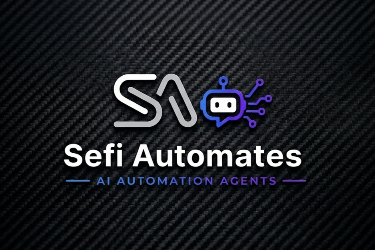
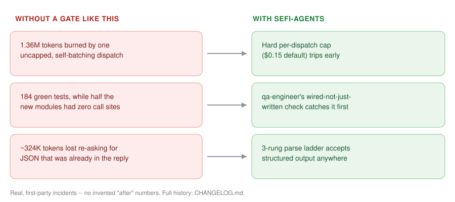

<p align="center"></p>

<h1 align="center">sefi-agents</h1>
<p align="center"><strong>A software company in a plugin.</strong></p>

<p align="center">
<a href="https://github.com/xsefirosus/sefi-agents/actions/workflows/ci.yml"></a>
<a href="LICENSE"></a>
<a href="#faq"></a>
<a href="#works-with-your-harness"></a>
</p>

Fourteen markdown-defined agents -- product manager, full-stack engineer, QA, security,
DevOps, design, and more -- that plan, build, judge, and remember as a team, with hard
budget caps and a human holding the merge button.

One install, no separate runtime: no database, no hosted service, no dependency tree --
markdown and POSIX shell underneath, nothing phoning home.

```
/plugin marketplace add xsefirosus/sefi-agents
/plugin install sefi-core@sefi-agents
/sefi:init
```

Or hand the setup to any coding agent:

> Help me set up sefi-agents by following
> https://raw.githubusercontent.com/xsefirosus/sefi-agents/main/Install.md

**Contents:** [Why this exists](#why-this-exists) -- [How it compares](#how-it-compares) --
[The team](#the-team-14-agents) -- [The skills](#the-skills-12) --
[The loops](#the-loops-2-shipped-template-for-more) --
[Memory](#memory-that-survives-the-session) -- [Harness support](#works-with-your-harness) --
[Safety rails](#safety-rails-all-of-them-in-one-place) -- [Proof](#proof) -- [FAQ](#faq) --
[Contributing](#contributing) -- [License](#license)

## Why this exists

Most agent setups fail the same three ways:

- **The writer grades its own homework.** Same model writes the code and reviews it.
- **Tokens blow out.** Nothing bounds a runaway loop.
- **Every session starts amnesiac.** State lives in a context window that evaporates.

We shipped all three failures first, in the author's previous agent system (Python/
FastAPI). The post-mortem is public, not hidden: [docs/ANTIPATTERNS.md](docs/ANTIPATTERNS.md)
maps every failure to the mechanism here that now prevents it.

## How it compares

Three real incidents, no invented "after" numbers -- full history in [CHANGELOG.md](CHANGELOG.md):



No names beyond that -- check any framework you're evaluating against these rows yourself:

| | sefi-agents | typical agent framework |
|---|---|---|
| Who judges the work | a separate adversarial qa-engineer, different model where possible | the model that wrote it reviews itself |
| Verdict basis | executed evidence: re-run commands, before/after pairs | "the code looks right" |
| Runtime | markdown + POSIX shell | a language runtime + dependency tree |
| Cost control | hard caps: per-run, daily, AND per-dispatch | rarely built in |
| Memory | a human-readable Obsidian-style vault, in your git repo | opaque state or a hosted service |
| Autonomy boundary | opens PRs, never merges | often merge- or deploy-capable by default |
| Hallucination policy | UNKNOWN/PENDING instead of guesses, CI-enforced | unstated |
| Self-improvement | bounded, ledgered, revertible by commit SHA, propose-only | unbounded, absent, or can't undo itself |
| Portability | Claude Code, Hermes, OpenCode, Codex | usually locked to its own runner |

## The team (14 agents)

An org chart, not a swarm. Each agent is a markdown file with a tool whitelist, a
harness-neutral model tier, an output contract, and an escalation path.

| Agent | Use for | Tier |
|---|---|---|
| qa-engineer | adversarial PASS/REJECT against executed evidence | high |
| security-engineer | trust-boundary review: secrets, injection, deps | high |
| engineering-manager | routes work, enforces contracts and budgets, never codes | mid |
| product-manager | goal -> checkable plan with grep-countable steps | mid |
| software-engineer | full-stack vertical slices in isolated worktrees | mid |
| ui-ux-designer | build, audit, redesign, or study a UI, direction-first | mid |
| devops-engineer | CI/CD, worktrees, scheduling, budget plumbing | mid |
| solutions-architect | n8n / Make / GoHighLevel / RAG / Vapi specs | mid |
| quant-analyst | trading-strategy gates and tier promotion | mid |
| research-analyst | web/repo/doc context, returned as a bounded digest | low |
| support-engineer | inbox and issue triage, consume-before-act | low |
| knowledge-manager | memory vault curation, append-only | low |
| technical-writer | READMEs, changelogs, guides -- verified claims only | low |
| prompt-engineer | Stage 0 -- restates a raw human message into single-intent asks | low |

- Tiers map to a real model per harness in one file: `config/model-map.yml`. A new model is
  an edit there, not a pass over 14 agent files.
- Claude Code: opus/sonnet/haiku. Codex: gpt-5.6-sol/terra/luna. OpenCode + Hermes:
  `flexible` -- their free-model catalogs rotate too fast to hardcode (one pinned model was
  retired 10 days after being verified real), so both defer to whatever model you pick.
- `qa-engineer: high` above `software-engineer: mid` is the point: a different, stronger
  judge. CI warns when a harness collapses both to one model instead (see FAQ for why a
  small model is still enough on its own).

## The skills (12)

The always-loaded router stays thin; craft lives in skills that load on demand:

- **sefi-orchestration** -- routing, handoffs with pinned output paths, the parse ladder.
- **anti-hallucination** -- the canonical no-invention rule: UNKNOWN and PENDING instead
  of plausible guesses; every claim traces to a file, a command, or a named source.
  CI rejects any agent or skill missing its pointer to this rule.
- **frontend-design** -- anti-slop UI across build/audit/redesign/study: one committed
  direction from a named lane catalog, typography-first, WCAG AA as a gate, plus
  illustrative domain heuristics and a two-tier slop-tells checklist.
- **backend-design** -- contract-first APIs, trust-boundary validation, idempotent
  mutations, reversible migrations, an explicit error taxonomy.
- **security-review** -- the six-surface gate: secrets, injection, unsafe constructs,
  dependencies, authorization, data handling.
- **memory-protocol** -- the vault contract: router reads, privacy-filtered writes,
  tiered promotion (trace -> policy -> fact).
- **loop-engineering** -- the five moves every loop implements: discovery, handoff,
  verification, persistence, scheduling.
- **retro-improve** -- bounded self-improvement: edits only its own files, 3 sentences
  per file per run, new skills require human approval.
- **technical-writing** -- audience-first docs where every command was actually run.
- **strategy-gate** -- hard trading gates (PF >= 1.30, DD <= 5%, expectancy >= 0.20R,
  CoV <= 0.25) with a promotion ladder.
- **n8n-workflow-design** -- client automation specs with idempotency, retries, webhook
  security, and cost-per-run.
- **terse-mode** -- output compression for narration, config-gated (ships enabled).

Skills are either user-invoked (typed as `/skill-name`, like Commands) or model-invoked
(loaded automatically during a loop). A user-invoked skill may call a model-invoked one,
never another user-invoked one -- so agents can't chain interactive commands by accident.

## The loops (2 shipped, template for more)

Every loop is the same five-move cycle -- a loop spec that skips one doesn't ship; CI
rejects it:


```mermaid
flowchart LR
    A[Discovery] --> B[Handoff]
    B --> C[Verification]
    C --> D[Persistence]
    D --> E[Scheduling]
    E -.->|next cycle| A
```

- **morning-triage** -- daily: support-engineer discovers (failed CI, new issues),
  software-engineer drafts in isolated worktrees, qa-engineer judges, PRs open for you.
- **weekly-retro** -- weekly: reads the metrics ledger, proposes bounded skill
  improvements, logs SKIP with a reason when the data says nothing needs changing.

Every loop names all five moves plus its human checkpoint, and CI rejects one that does
not. `/sefi:loop-new` scaffolds your own.

## Memory that survives the session

- `/sefi:init` scaffolds an Obsidian-compatible vault: daily notes, decisions (supersede,
  never delete), a generated router.
- Plain markdown in your repo -- open it in Obsidian, grep it, diff it in PRs. No database,
  no service, no vendor.
- **Read:** a `SessionStart` hook injects the router (capped at 1,500 chars) every session.
- **Write:** at `close_out` -- end of a loop cycle -- the knowledge-manager files that
  cycle's durable observations, or logs SKIP. It's the vault's only writer.
- Nothing is captured by a raw hook: a deterministic script can't judge what's a credential,
  so only an agent dispatch (running the privacy filter first) writes to the vault.
- This repo dogfoods itself: `memory/`, `state/`, `loops/`, `config/` here are `/sefi:init`
  run against sefi-agents. The shipped plugin carries only `agents/`, `skills/`,
  `commands/`, `hooks/` -- installing it never pulls in this repo's own vault.

## Works with your harness

| Harness | How | Notes |
|---|---|---|
| Claude Code | plugin install (above) | full hook + subagent support |
| Hermes Agent | [adapters/HERMES.md](adapters/HERMES.md) | one-command skill install (`install-hermes.sh`); 10 of 12 install automatically, 2 print a verified manual fix inline -- see FAQ |
| OpenCode | [adapters/OPENCODE.md](adapters/OPENCODE.md) | headless `opencode run` for CI loops |
| Codex | [adapters/CODEX.md](adapters/CODEX.md) | plugin marketplace install; `multi_agent` enabled by default |

## Safety rails (all of them, in one place)

- The writer never grades its own work; a separate qa-engineer judges executed evidence.
- A security-engineer gates diffs that touch trust boundaries.
- Deterministic gates the model cannot skip: `gate.sh` (lint/typecheck/tests, with
  per-operation timeout classes), `validate-plan-structure.sh` on every plan,
  `check-handoff.sh` on every dispatch, and `probe-tools.sh` before a loop's first move.
- Hard budget caps: per-run, daily, per-dispatch; retries capped and counted on disk. The
  budget gate fails CLOSED -- it exits distinctly when it cannot measure, rather than
  passing a check it never performed.
- Anything uncertain lands in `inbox/` for you, with a fixed confirm/change/exit contract.
- Loops open PRs; merging is yours. One canonical rule, linked from every agent that
  could reach a destructive action.

## Proof

The repo lints itself. This suite runs on every push (badge above), and locally in one
command:

```
$ bash plugins/sefi-core/scripts/ci/run-all.sh
validate-agents: OK (14 agent files validated)
validate-skills: OK (12 SKILL.md validated)
validate-doc-counts: OK (agents=14 skills=12 commands=6 loops=2, all prose matches disk)
validate-loops: OK (2 loop spec(s) validated, plus 2 in this project's loops/)
validate-budget: OK (all caps present and bounded)
validate-config-wired: OK (12 config keys, all wired)
validate-no-personal-paths: OK (no personal paths in shipped files)
validate-no-orphans: OK (references, templates, agents all wired)
validate-links: OK (58 files scanned, all repo-path references resolve; bare script names checked)
validate-script-refs: OK (43 files scanned, every scripts/*.sh reference carries ${CLAUDE_PLUGIN_ROOT}/)
validate-routing: OK (routing-table agents exist, fixtures resolve, no duplicate triggers)
validate-model-map: OK (14 agents, 4 harnesses, 41 scripts parse; 2 warning(s))
validate-adapters: OK (install-hermes.sh skill list matches disk, adapter doc paths resolve)
check-unicode-safety: OK (124 files scanned, ASCII-clean)
validate-token-budget: OK (all within token budgets; agents total 8959 words)
test-scripts: OK (147 passed)
test-integration: OK (30 passed) -- full loop skeleton executed end to end
CI: all validators passed
```

- `test-scripts.sh` proves each script alone. `test-integration.sh` runs the whole loop
  end to end in a real throwaway repo: worktree, `gate.sh`, Done Criteria, metrics row, a
  `close_out` note that survives into the next session, a revertible ledger SHA, and a
  check that nothing merged itself.
- It proves the machinery, not the judgment -- every dispatch inside it is scripted, so it
  says nothing about whether a model decides well, only that the seams hold.
- Agents have word budgets, skills have line caps -- prose that bloats fails the build.
  Counts drift as the repo grows; run the command yourself rather than trust this snapshot.

## FAQ

**Do I need expensive models?** No. Model tiers are advisory, and the architecture
assumes a cheap model: deterministic scripts assemble context and enforce gates, the LLM
only does the creative step between them. The predecessor ran at ~45% dispatch success on
a free model and still delivered, because the gates caught the other half.

**Does it work on Windows?** Yes -- the scripts are POSIX-friendly and this repo is built
and CI-validated via Git Bash on Windows as well as Linux CI.

**Where does my data go?** Nowhere. There is no runtime, no telemetry, and no network
call in the plugin. If you use a free-window model via an adapter, read the caveat in
[adapters/HERMES.md](adapters/HERMES.md) first: never run client or proprietary code
through models that may train on inputs.

**Can it merge or deploy something by itself?** No. Loops open PRs and stop. The rule is
stated once, linked everywhere, and CI checks every loop names its human checkpoint.

**What happens when the model does not know something?** It says so: unknown lookups
come back as UNKNOWN and uncomputed values as PENDING -- never a plausible guess. That
rule is a skill, and CI fails any agent or skill that drops its pointer to it.

**Why didn't all the skills install automatically on Hermes?** Its security scanner
false-flags two skills (`sefi-orchestration`, `security-review`) because they *name*
dangerous patterns to guard against, and the scanner can't tell "warns about" from
"does." The other 10 install fine; `install-hermes.sh` prints the exact manual fix for
these two inline. See [adapters/HERMES.md](adapters/HERMES.md) section 8.

**Do I need Obsidian?** No. The vault is plain markdown; Obsidian just makes it nicer.

## Contributing

Run the suite before a PR:

```
bash plugins/sefi-core/scripts/ci/run-all.sh
```

The validators are the contribution guide in executable form: budgets, single-line
descriptions, wired references, ASCII-clean text, and the anti-hallucination pointer in
every agent and skill.

## License

MIT. See [LICENSE](LICENSE).
