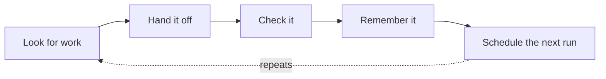

<p align="center"></p>

<h1 align="center">sefi-agents</h1>
<p align="center"><strong>A software company in a plugin.</strong></p>

<p align="center">
<a href="https://github.com/xsefirosus/sefi-agents/actions/workflows/ci.yml"></a>
<a href="LICENSE"></a>
<a href="#faq"></a>
<a href="#works-with-your-harness"></a>
</p>

Thirteen AI agents -- a planner, a builder, a reviewer, a security checker, a writer,
and more -- that work as a team: plan, build, check, and remember, with spending limits
and a human approving every merge.

One install, no separate setup: no database, no server to run, nothing else to
download. Just this plugin, plus the AI tool you already use.

**Install for Claude Code:**

```
/plugin marketplace add xsefirosus/sefi-agents
/plugin install sefi-core@sefi-agents
/sefi:init
```

Using OpenCode, Hermes Agent, or Codex instead? The install steps are different for each
-- see [Where it runs](#works-with-your-harness) below, don't run the commands above.

Or hand the setup to any coding agent -- this one detects which tool you're using and
installs the right way for it, Claude Code or otherwise:

> Help me set up sefi-agents by following
> https://raw.githubusercontent.com/xsefirosus/sefi-agents/main/Install.md

**Contents:** [Why this exists](#why-this-exists) -- [How it compares](#how-it-compares) --
[The team](#the-team-13-agents) -- [The skills](#the-skills-11) --
[The loops](#the-loops-2-shipped-template-for-more) --
[Memory](#memory-that-survives-the-session) -- [Where it runs](#works-with-your-harness) --
[Safety rules](#safety-rails-all-of-them-in-one-place) -- [Proof](#proof) -- [FAQ](#faq) --
[Contributing](#contributing) -- [License](#license)

## Why this exists

Most AI coding setups fail the same three ways:

- **The AI grades its own homework.** The same model that writes the code also reviews
  it, so it rarely catches its own mistakes.
- **Spending gets out of control.** Nothing stops a task from running (and costing money)
  far longer than it should.
- **Every conversation starts from zero.** Whatever the AI learned yesterday is gone
  today, because nothing wrote it down.

We hit all three problems first, in the author's earlier version of this project. That
post-mortem is public, not hidden: [docs/ANTIPATTERNS.md](docs/ANTIPATTERNS.md) lists each
failure next to the fix that now prevents it.

## How it compares

Three real incidents from this project's own history, no made-up "after" numbers -- full
history in [CHANGELOG.md](CHANGELOG.md):


(Usage is measured in "tokens" -- small chunks of text, roughly three-quarters of a word
each, that AI providers use to price and limit how much a task can do.)

Beyond those three, an honest comparison -- no competitor named, check any tool you're
considering against these rows yourself:

| | sefi-agents | a typical AI coding setup |
|---|---|---|
| Who checks the work | a separate reviewer, often a different, stronger model | the same AI that wrote it |
| How it proves something works | it runs the code and shows before/after results | it just says "looks good" |
| What you need to install | this one plugin | often a database, a server, or extra software |
| Spending limits | per task, per day, and overall -- all built in | usually none |
| Memory | plain text files in your own project, you can read them | often hidden, or on someone else's server |
| Can it merge or deploy by itself | no -- it opens a pull request and stops | often yes, by default |
| What it does when it doesn't know something | says so, plainly -- never guesses | usually guesses and sounds confident |
| Self-improvement | small, tracked changes you approve; easy to undo | often unbounded, or can't be undone |
| Works with | Claude Code, Hermes, OpenCode, Codex | usually locked to one tool |

## The team (13 agents)

Thirteen AI agents, each with one job and a written contract for what it may touch, run,
and change.

| Agent | What it does | Cost |
|---|---|---|
| qa-engineer | reviews finished work; approves or rejects with evidence | high |
| security-engineer | checks changes that touch sensitive code (logins, secrets, external input) | high |
| engineering-manager | routes work to the right agent, never writes code itself | medium |
| product-manager | turns a goal into a checkable, step-by-step plan | medium |
| software-engineer | builds one planned piece at a time, in its own workspace | medium |
| ui-ux-designer | designs, checks, or redesigns a user interface | medium |
| devops-engineer | handles CI/CD, scheduling, and spending limits | medium |
| solutions-architect | designs automations (n8n, Make, GoHighLevel, and similar) | medium |
| research-analyst | gathers web or codebase context into a short summary | low |
| support-engineer | sorts incoming issues and routes them | low |
| knowledge-manager | keeps the project's memory tidy, never deletes anything | low |
| technical-writer | writes docs and guides, every claim double-checked | low |
| prompt-engineer | clarifies a raw request before it's routed to an agent | low |

- Each agent's "cost" maps to a real AI model, listed once in `config/model-map.yml`. To
  change models later, you edit one file, not 13.
- On OpenCode and Hermes, that setting is left open (`flexible`) on purpose -- their free
  model options change too often to lock one in, so you just pick a model yourself in
  that tool.
- The reviewer (qa-engineer) is set to a stronger tier than the builder
  (software-engineer) by design, so the review is a genuine second opinion, not the same
  model checking its own work.

## The skills (11)

Beyond the 13 agents, "skills" are shared playbooks an agent loads only when the task
needs it:

- **sefi-orchestration** -- decides which agent handles a request.
- **anti-hallucination** -- the core honesty rule: say "unknown" instead of guessing, and
  back up every claim with a real source.
- **frontend-design** -- keeps generated user interfaces from looking generic or AI-made.
- **backend-design** -- API and data-handling best practices: safe inputs, no half-done
  changes, clear error handling.
- **security-review** -- checks for secrets, unsafe code, and access-control mistakes.
- **memory-protocol** -- the rules for how the project's memory is read and written.
- **loop-engineering** -- the five-step pattern every automated cycle follows.
- **retro-improve** -- small, self-review-based improvements to the agents themselves,
  always in tiny, reversible steps.
- **technical-writing** -- how to write docs where every claim was actually checked.
- **n8n-workflow-design** -- best practices for building client automations.
- **terse-mode** -- keeps the AI's own status updates short.

Some skills you can call by name (typing `/skill-name`); others load automatically when
an agent needs them. A skill you call by name can use an automatic one, but never call
another named one directly -- so it can't accidentally chain commands on its own.

## The loops (2 shipped, template for more)

A "loop" is a repeating job (like a daily check) that always follows the same five steps:


```mermaid
flowchart LR
    A[Look for work] --> B[Hand it off]
    B --> C[Check it]
    C --> D[Remember it]
    D --> E[Schedule the next run]
    E -.->|repeats| A
```

- **morning-triage** -- daily: checks for failed builds and new issues, drafts fixes, has
  them reviewed, and opens pull requests for you.
- **weekly-retro** -- weekly: looks at what went wrong recently and proposes small,
  approved-by-you improvements.

Every loop must name all five steps and who approves it, or it's rejected automatically.
`/sefi:loop-new` helps you build your own.

## Memory that survives the session

- `/sefi:init` sets up a folder of plain text notes in your project: daily notes and
  decisions, plus an index that links them together.
- It's just markdown files in your own repo -- readable, searchable, and visible in your
  pull requests. No database, no external service.
- **Reading:** every new session automatically loads a short index (capped at 1,500
  characters) so it knows what's already been decided.
- **Writing:** at the end of a work cycle, the knowledge-manager agent -- and only that
  agent -- writes down what's worth remembering, or notes that there was nothing new.
- Nothing is written down automatically by a script: only an agent can decide what's safe
  to save, after removing anything that looks like a password or secret.
- This project uses its own memory system on itself, but a fresh install of the plugin
  starts with an empty one -- your project's memory is always separate from this repo's.

## Works with your harness

| Tool | How to install | Notes |
|---|---|---|
| Claude Code | plugin install (above) | full support |
| Hermes Agent | [adapters/HERMES.md](adapters/HERMES.md) | one command; 11 of 13 skills install automatically, 2 need one manual step (see FAQ) |
| OpenCode | [adapters/OPENCODE.md](adapters/OPENCODE.md) | can run unattended for scheduled jobs |
| Codex | [adapters/CODEX.md](adapters/CODEX.md) | plugin marketplace install |

## Safety rails (all of them, in one place)

- The agent that writes code never approves its own work -- a separate reviewer checks
  it with real evidence.
- A security checker reviews any change touching sensitive code.
- Automated checks the AI can't skip: tests and linting, plan structure, handoffs between
  agents, and tool availability before a job starts.
- Spending limits: per task, per day, and overall. If spending can't be measured, the
  system stops and says so instead of assuming it's fine.
- Anything the system isn't sure about goes to a review folder (`inbox/`) for you to
  decide.
- Nothing merges or deploys by itself. Every automated job stops at a pull request and
  waits for you.

## Proof

This project checks itself. The same checks run on every push (badge above), and you can
run them yourself, in one command:

```
$ bash plugins/sefi-core/scripts/ci/run-all.sh
validate-agents: OK (13 agent files validated)
validate-skills: OK (11 SKILL.md validated)
validate-doc-counts: OK (agents=13 skills=11 commands=6 loops=2, all prose matches disk)
validate-loops: OK (2 loop spec(s) validated, plus 2 in this project's loops/)
validate-budget: OK (all caps present and bounded)
validate-config-wired: OK (12 config keys, all wired)
validate-no-personal-paths: OK (no personal paths in shipped files)
validate-no-orphans: OK (references, templates, agents all wired)
validate-links: OK (58 files scanned, all repo-path references resolve; bare script names checked)
validate-script-refs: OK (43 files scanned, every scripts/*.sh reference carries ${CLAUDE_PLUGIN_ROOT}/)
validate-routing: OK (routing-table agents exist, fixtures resolve, no duplicate triggers)
validate-model-map: OK (13 agents, 4 harnesses, 41 scripts parse; 2 warning(s))
validate-adapters: OK (install-hermes.sh skill list matches disk, adapter doc paths resolve)
check-unicode-safety: OK (124 files scanned, ASCII-clean)
validate-token-budget: OK (all within token budgets; agents total 8316 words)
test-scripts: OK (148 passed)
test-integration: OK (30 passed) -- full loop skeleton executed end to end
CI: all validators passed
```

- The last two lines matter most: one proves every script works by itself, the other
  proves the whole cycle works together, end to end, in a real test project -- with a real
  check that nothing merged itself.
- This proves the machinery works, not that the AI always makes good calls -- every
  agent's part in that test is scripted, not judged.
- Every agent and skill has a length limit, and going over it fails the build. Exact
  numbers change as the project grows -- run the command yourself instead of trusting this
  snapshot.

## FAQ

**Do I need an expensive AI model?** No. Cheap models are fine -- scripts handle the
repetitive checking, so the AI is only doing the creative part. In earlier testing, a
free model only succeeded on its own about 45% of the time, and the review step still
caught the rest.

**Does it work on Windows?** Yes -- it's tested on both Windows (Git Bash) and Linux.

**Where does my data go?** Nowhere. Nothing here calls home or tracks you. If you use a
free trial of some AI model, check [adapters/HERMES.md](adapters/HERMES.md) first: don't
run private code through a model that might learn from your input.

**Can it merge or deploy something by itself?** No. It opens a pull request and stops,
every time -- that rule is checked automatically, not just written down.

**What happens when the AI doesn't know something?** It says so, instead of guessing.
That rule is enforced automatically across every agent and skill.

**Why didn't every skill install automatically on Hermes?** Hermes scans skills for
risky-looking content, and two of ours get flagged by mistake -- they *describe* risky
patterns in order to guard against them, and the scanner can't yet tell the difference.
The other 11 skills install fine; the installer prints the two-step manual fix for the
rest. See [adapters/HERMES.md](adapters/HERMES.md) section 8.

**Do I need Obsidian?** No. The memory notes are plain text files; Obsidian just makes
them nicer to browse.

## Contributing

Run the full check before opening a pull request:

```
bash plugins/sefi-core/scripts/ci/run-all.sh
```

Those checks are the actual contribution guide: length limits, short descriptions,
nothing broken or unused, and the honesty rule present in every agent and skill.

## License

MIT. See [LICENSE](LICENSE).
